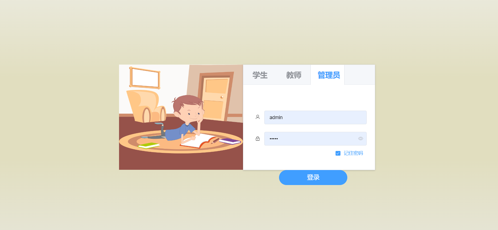
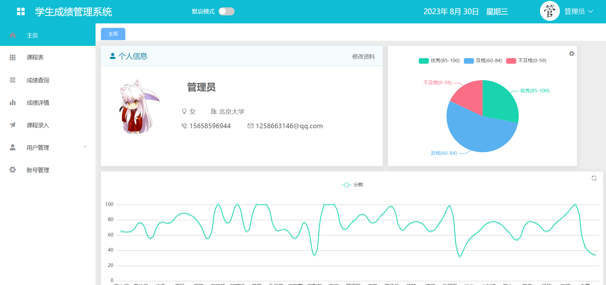
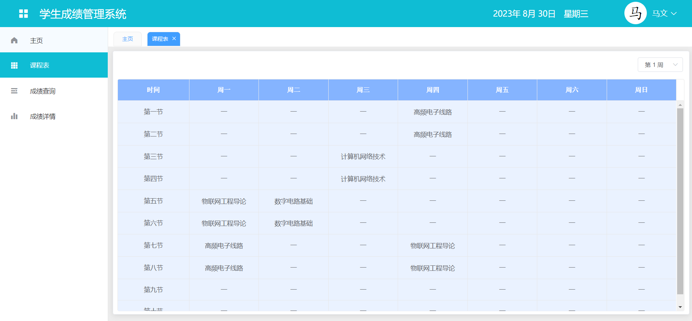
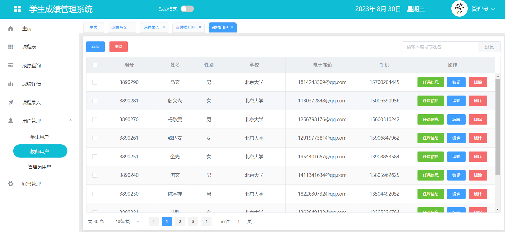
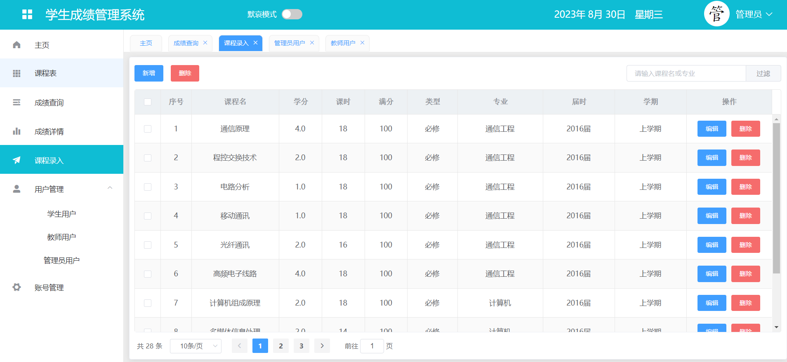
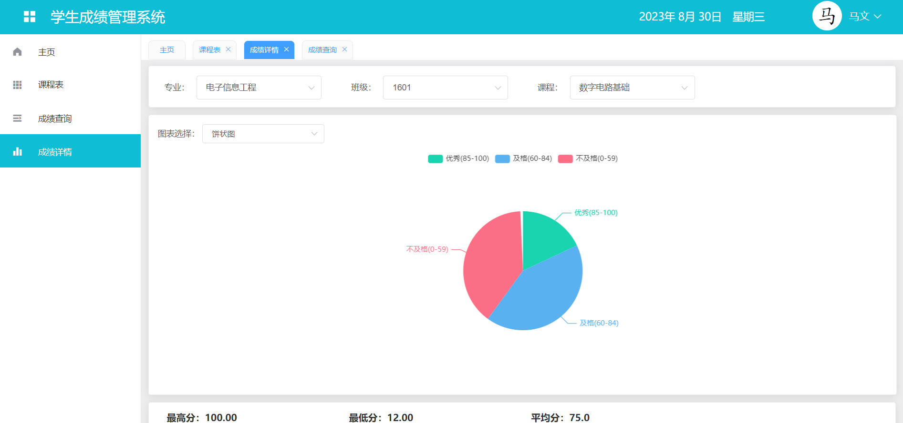

# 基于SpringBoot的学生成绩管理系统 

（源代码+12000字文档+ppt）

## 项目简介

基于SpringBoot的学生成绩管理系统，是一套多角色的成绩管理系统，包含了学生、老师、管理员三种角色。 
本系统主要包含了管理员对学生和老师管理、排课、成绩查询、课表查询等功能。 
本系统是一套前后端分离的系统，前端使用vue+elementui，后端使用springboot框架。数据库使用的是mysql数据库。 
该系统功能完善，界面美观，非常适合作为毕设或者课程作业以及新手开发学习。 

## 功能介绍
 

## 技术服务

## 系统图片
#### 1.登录页面
 
#### 2.管理首页
 
#### 3.查看课程表
 
#### 4.用户管理
 
#### 5.课程录入
 
#### 6.成绩详情统计
 

